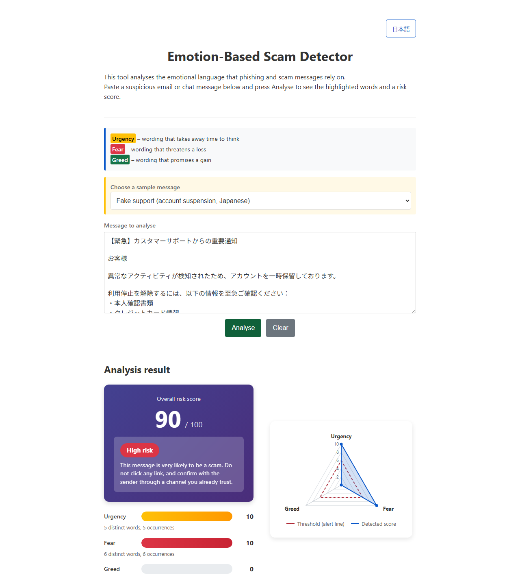
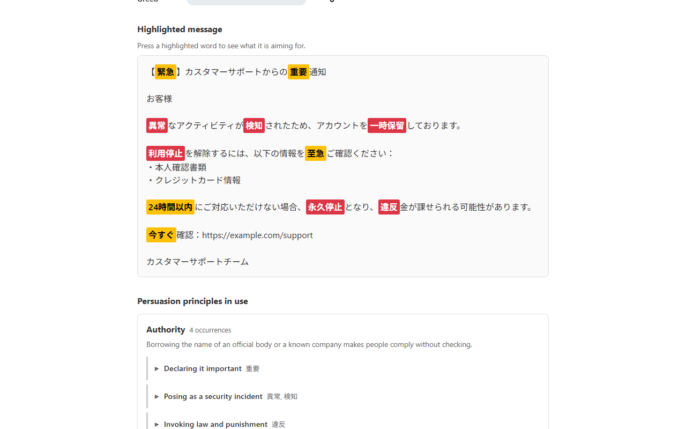
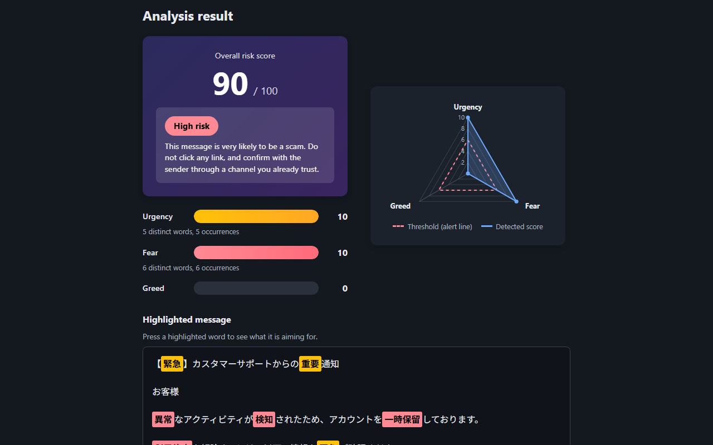
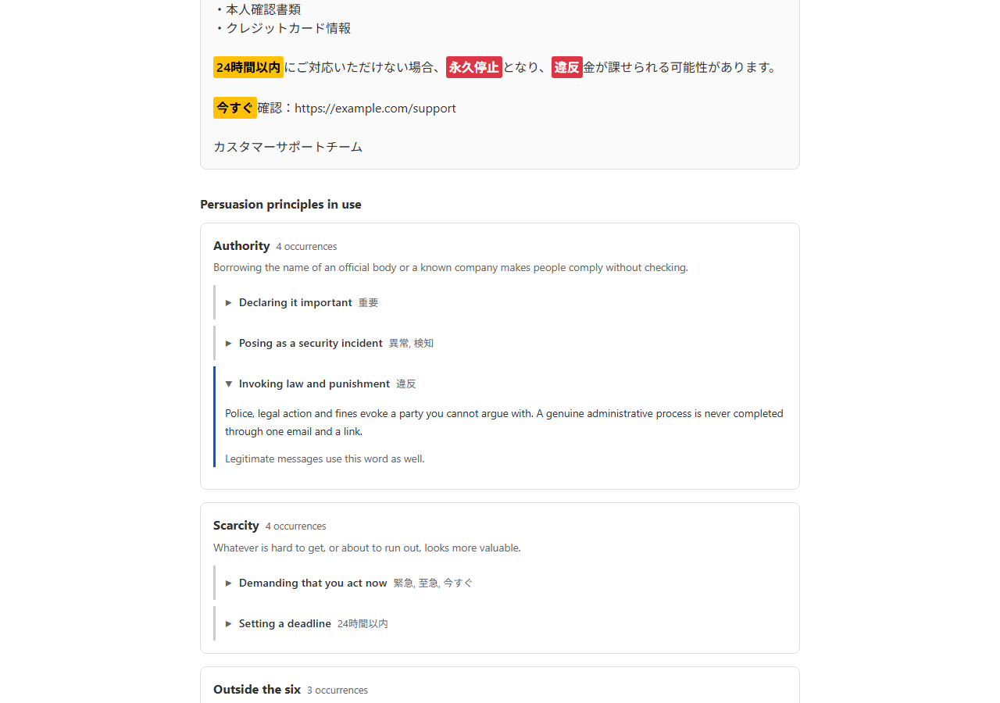

English · [日本語](README.md)

# Emotion-Based Scam Detector - Emotional trigger detector for messages


[](https://ipusiron.github.io/emotion-based-scam-detector/)

**Day081 - 100 Security Tools with Generative AI**

Emotion-Based Scam Detector finds the words that push three emotions — urgency, fear and greed — in an email or a chat message.

Phishing and scam messages scatter emotional language to stop the reader from thinking. This tool colours those words and shows how hard each emotion is being pushed, as a score and a radar chart.

Whatever you paste stays in your browser. Nothing is sent anywhere.

---

## 🌐 Demo

👉 **[https://ipusiron.github.io/emotion-based-scam-detector/](https://ipusiron.github.io/emotion-based-scam-detector/)**

You can try it straight from your browser.

---

## 📸 Screenshots

>
>*A message posing as customer support, scored 90 out of 100 and judged high risk*

>
>*Detected words are coloured by emotion. Multi-character terms stay in one piece*

>
>*The colours switch with the system theme, and the radar chart follows*

>
>*Which persuasion principle each detected word belongs to. Pressing a highlighted word opens why that tactic works*

---

## ✨ Features

- Trigger detection: three categories — urgency (emergency), fear and greed — against a dictionary of 167 terms in Japanese and English
- Highlighting: detected words are coloured by category. Longer terms win, so a long term is never broken up by a shorter one inside it
- Overall risk score: 0 to 100, reported in four bands (very low, low, medium, high)
- Per-category scores: 0 to 10 each, with how many distinct words were found and how often
- Radar chart: three axes comparing the scores against an alert line. Drawn as SVG, with no charting library
- Sample messages: 14 presets. Nine scam messages (phishing, fake delivery notice, fake tax office, investment scam, romance scam and more) and five legitimate notices (delivery, bank, workplace reminder, campaign, sign-in alert)
- False positives on purpose: analysing a legitimate sample explains that legitimate notices use the same words
- Persuasion breakdown: detected words are grouped into 14 tactics, each mapped to one of Cialdini's six principles
- Per-word explanation: pressing a highlighted word opens why that tactic works, and that legitimate messages use it too
- Customisable dictionary: edit `data/dictionary.json` to add your own terms
- Japanese and English interface, remembered between visits
- Dark mode following the system setting
- Works offline: no outbound requests at all, so it keeps working once the page has loaded

---

## 📖 How to use

1. Pick a sample, or paste the message you want to check into the text area.
2. Press Analyse.
3. Read the result.
   - Overall risk score: 0 to 100
   - Per-category scores: urgency, fear and greed out of 10, with the distinct words and occurrences found
   - Radar chart: the shape of the three emotions
   - Highlighted message: which words were detected
4. A higher score means the message leans harder on emotional language. Use it as one input when you decide whether to trust the sender or the links.

### Running locally

```bash
git clone https://github.com/ipusiron/emotion-based-scam-detector.git
cd emotion-based-scam-detector
python -m http.server 8000
# then open http://localhost:8000 in your browser
```

You can also open `index.html` directly. In that case `fetch` is unavailable, so the built-in dictionary in `js/dictionary.js` is used and the page says so. Serve the folder over HTTP if you want your edits to `data/dictionary.json` to take effect.

---

## 📐 Screen layout

| Area | Element | Purpose |
|---|---|---|
| Top | Legend | The colour of each category and the feeling it targets |
| Top | Sample selector | Loads one of the 14 presets |
| Middle | Text area | Where you paste the message |
| Result, left | Overall score and verdict | 0 to 100, one of four bands, and what to do |
| Result, left | Per-category scores | A bar out of 10, with distinct words and occurrences |
| Result, right | Radar chart | The three axes against the alert line at 6 |
| Result, below | Highlighted message | The message with the detected words coloured |
| Result, below | What to do | Eight practical steps, collapsed by default |

---

## 🎯 Use cases

The tool only counts how the words in a message compare with a dictionary. That simplicity means it is useful well beyond security work.

### Security learning and practice

- Awareness training: have people paste a real phishing email and compare the radar shapes. You can point at where the pressure sits instead of describing it.
- A first look at a suspicious message: paste the body, read the score and the detected words, and only then check the sender. A low score is not a clearance, so treat it as a starting point.
- Preparing filter rules: run a collection of scam messages through it and count which terms keep coming up.
- Analysis with your own wordlist: replace `data/dictionary.json` with terms you collected yourself, and the tool becomes a way to study messages aimed at one industry or region.

### Education

- Language and media classes: make visible how a writer chooses words when they want the reader to hurry. It applies to persuasion in general, not only to fraud.
- Fraud-prevention talks for older people: work through the presets and watch words such as "urgent", "today only" and "penalty" light up. The amount of colour carries the point even for people who find dense text hard.
- Language learning: compare wording that applies pressure with wording that makes a polite request, term by term.

### Work outside security

- Checking your own notifications: make sure the emails your support or communications team sends do not read like a scam. A legitimate notice stuffed with "urgent", "account suspension" and "by today" will be treated as one.
- Reviewing marketing copy: count how dense "limited", "free", "guaranteed" and "only today" are. Copy whose greed score pins at 10 is also raising the reader's guard.
- Revisiting internal notices: wording with a high fear score may be making colleagues anxious. Use it as a prompt to rewrite.

### Everyday life

- Checking together at home: paste a message that arrived on a family member's phone and read the coloured words aloud together. It gives the household a shared signal to stop and think.
- Marketplace and social media exchanges: see how much a trading partner's messages rely on hurrying you or promising a gain.

### Hobbies and creative work

- Writing fiction or scripts: count the emotional terms you gave a con artist or a negotiator, and check the balance is the one you intended.
- Puzzle hunts, tabletop games and escape rooms: write a convincing fake notice for players to see through, and tune how much emotional language it carries.
- Collecting and watching spam: analyse what you have gathered and keep your own record of how the tactics shift.

### Research

- Studying persuasion: research on phishing maps its wording onto Cialdini's six principles (authority, social proof, liking, reciprocity, commitment and scarcity). The three categories here are a slice of that, so the tool is a starting point for asking which axes the dictionary is missing.
- Comparing languages: analyse the Japanese and English versions of a similar message and compare the wording. The dictionary covers both.

### Combining with other tools

- Use this tool for the emotional language in the body, and a separate tool for the links. This one looks at neither the sender nor the URLs.
- Line it up with the other tools in "100 Security Tools with Generative AI" to walk through the stages of a social engineering attempt.

---

## 🔬 How it works

### Matching

The dictionary terms are sorted longest first, and the message is scanned once from the start. A matched range is skipped over, so no position is ever counted twice.

A word boundary is required only on the side where the dictionary term itself ends in an ASCII alphanumeric character.

| Term | Message | Detected | Why |
|---|---|---|---|
| `now` | `he is known now` | only the final `now` | both ends are ASCII, so it cannot match inside an English word |
| `24時間以内` | `期限は24時間以内です` | it matches | the term ends in Japanese, so anything may follow |
| `利用停止` | `利用停止を解除` | `利用停止` | longer terms are tried first, so `停止` does not break it up |

### Scoring

Each category is scored from the number of distinct terms found and how often they occurred.

```
raw      = distinct terms + 0.5 × (occurrences − distinct terms)
category = min(10, round(raw × 2))
```

Repeats after the first count half. Five distinct terms reach the cap of 10.

The overall score sorts the category scores and weights the strongest most heavily.

```
s1 ≥ s2 ≥ s3 = the category scores in descending order
overall      = round(10 × (0.6×s1 + 0.3×s2 + 0.1×s3))
```

The strongest emotions are weighted rather than averaged because real scams do not spread themselves evenly over three emotions. Phishing leans on urgency and fear; a prize notice leans on urgency and greed.

The verdict follows thresholds on the overall score.

| Overall | Verdict |
|---|---|
| 70 and above | High risk |
| 40 to 69 | Medium risk |
| 15 to 39 | Low risk |
| 14 and below | Very low risk |

### Mapping to persuasion principles

The 167 dictionary terms are divided into 14 tactic groups. Each group is mapped to one of Cialdini's six principles of persuasion (authority, social proof, liking, reciprocity, commitment and consistency, scarcity).

| Tactic group | Principle | Terms |
|---|---|---|
| Demanding that you act now | Scarcity | 24 |
| Setting a deadline | Scarcity | 10 |
| Declaring it important | Authority | 4 |
| Invoking law and punishment | Authority | 18 |
| Threatening to cut you off | Outside the six | 23 |
| Posing as a security incident | Authority | 15 |
| Offering something for free | Reciprocity | 11 |
| Showing a discount or a refund | Reciprocity | 5 |
| Announcing that you won | Outside the six | 11 |
| Saying you were chosen | Liking | 7 |
| Limiting the number of places | Scarcity | 9 |
| Promising a return | Outside the six | 18 |
| Guaranteeing the outcome | Commitment and consistency | 6 |
| Naming a sum | Outside the six | 6 |

Groups that do not fit any of the six are marked "outside the six". The wish to avoid losing something you already have, and the reaction to a figure itself, sit outside Cialdini's framework. Saying so is more accurate than forcing a fit.

**This dictionary holds no term for social proof.** Phrasing such as "100,000 people already use this" or "success stories everywhere" does appear in real scam messages, but none of the current 167 terms covers it. Seeing which axis a dictionary is missing is one of the things this tool can show you.

After an analysis, the page lists which principles the detected words belong to. Pressing a highlighted word opens why that tactic works, and the reminder that legitimate messages use the same words.

### Scores of the sample messages

The nine scam samples score as follows.

| Sample | Urgency | Fear | Greed | Overall | Verdict |
|---|---|---|---|---|---|
| Phishing (account verification) | 10 | 8 | 0 | 84 | High risk |
| Fake delivery notice | 10 | 0 | 0 | 60 | Medium risk |
| Fake support (account suspension) | 10 | 10 | 0 | 90 | High risk |
| Fake tax office (unpaid tax) | 7 | 6 | 0 | 60 | Medium risk |
| Investment scam (high returns) | 6 | 0 | 10 | 78 | High risk |
| Fake prize notice | 8 | 2 | 10 | 86 | High risk |
| Fake side job offer | 2 | 0 | 10 | 66 | Medium risk |
| Romance scam (investment pitch) | 2 | 0 | 10 | 66 | Medium risk |
| Phishing (account security, English) | 10 | 8 | 2 | 86 | High risk |

The romance scam only reaches medium risk because the tactic avoids scattering emotional language and builds trust over time. A single message is hard to catch by dictionary matching, and the score says so.

Five legitimate messages ship with the tool as well.

| Sample | Urgency | Fear | Greed | Overall | Verdict |
|---|---|---|---|---|---|
| Legitimate delivery notice | 0 | 0 | 0 | 0 | Very low risk |
| Legitimate bank notice | 0 | 2 | 0 | 12 | Very low risk |
| Legitimate workplace reminder | 7 | 0 | 0 | 42 | Medium risk |
| Legitimate campaign notice | 0 | 2 | 8 | 54 | Medium risk |
| Legitimate sign-in alert | 0 | 6 | 0 | 36 | Low risk |

An internal reminder about an expense deadline reaches medium risk because "by today", "deadline" and "urgent" are ordinary words in a legitimate message. A legitimate campaign notice gets there through "limited", "free" and "bonus". The legitimate delivery notice, on the other hand, scores zero.

Analysing any of them brings up an explanation about false positives on the page, so you can confirm with numbers that a high score is not evidence of fraud and a low score is not proof of safety.

### Radar chart

The chart is drawn as SVG without any library. Axis `i` sits at `-90° + i × 360 / number of axes`, so the first axis points straight up. The function that produces the vertices is separate from the drawing, which is why the coordinates themselves are covered by tests. The number of axes follows the number of values, so adding a category changes nothing in the drawing code.

### Customising the dictionary

The terms live in [`data/dictionary.json`](./data/dictionary.json).

```json
{
  "emergency": ["urgent", "immediately", "至急", "緊急", "今すぐ"],
  "fear": ["penalty", "police", "罰金", "警察", "利用停止"],
  "greed": ["reward", "free", "報酬", "無料", "当選"]
}
```

It currently holds 167 terms: 38 for urgency, 56 for fear and 73 for greed. Reload the page after editing.

The same content is kept in [`js/dictionary.js`](./js/dictionary.js) as the copy used under `file://`. A test asserts the two are identical, so edit both when you add a term.

Adding a category also means touching the weight table in `js/scam-core.js`, the category list in `script.js`, the label and hint keys in `js/messages.js`, and the legend and score rows in `index.html`.

---

## 🔒 Security

- Client-side only: the message you paste is processed in the browser and never sent anywhere.
- Content Security Policy: `default-src 'self'` with no external origin allowed, and no inline script or style.
- XSS: the whole message is escaped first, and only the matched ranges are wrapped afterwards. Markup in the input can never reach the DOM as markup.
- No dependencies: no CDN and no npm packages. Everything the page loads comes from this repository.
- Referrer-Policy: `no-referrer`.

`X-Frame-Options`, `X-Content-Type-Options` and the CSP directive `frame-ancestors` have no effect in a `meta` tag. This tool does not pretend otherwise and treats them as HTTP headers, which GitHub Pages does not let you set.

---

## ⚠️ Caveats

The score only reflects how the words in the message compare with a dictionary. It does not look at:

- the sender address or the mail headers
- the links, or whether the visible text matches where they lead
- attachments
- the context, or the history of the conversation

Wording that is not in the dictionary is invisible to it. In the other direction, legitimate companies also write "important", "confirm" and "deadline", so genuine messages can score high. A low score is not proof that a message is safe.

Decide by contacting the company yourself, through the site or the number you already know.

---

## ❓ FAQ

**Q. Is anything I paste sent somewhere?**

A. No. The analysis happens entirely in your browser. The only requests are for the page itself and the dictionary file.

**Q. Why does opening the file directly say the built-in dictionary is in use?**

A. Browsers do not allow `fetch` under `file://`, so `data/dictionary.json` cannot be read. The contents are the same, so the result does not change. Serve the folder over HTTP only when you want to test your edits.

**Q. Does it work on languages other than Japanese?**

A. The dictionary holds English terms too, so English messages work. For another language, add terms to `data/dictionary.json` and `js/dictionary.js`.

**Q. Can I add a category?**

A. Yes. Add a key to the dictionary and a weight list of the same length to `TOTAL_WEIGHTS` in `js/scam-core.js`. The radar chart adapts to the number of axes by itself.

**Q. Is a message that stays under 70 safe?**

A. Not necessarily. Some scams use very little emotional language. The romance scam sample stopping at 66 is the example shipped with the tool.

---

## 🧪 Tests

```bash
npm test
```

Node.js 22 or newer. There are no dependencies; it uses `node --test` alone.

What is covered:

- Matching and scoring: longest-match, word boundaries, no double counting, and that all 167 dictionary terms are detected both alone and inside a sentence
- Radar chart: vertex coordinates and viewBox, and that a different number of axes still draws
- Dictionary: `data/dictionary.json` and `js/dictionary.js` being identical, the counts, and no term appearing in two categories
- Samples: the score and verdict of all 14 presets, matching the tables in this file
- Tactics and principles: every dictionary term belonging to exactly one group, the principle names being a fixed set, and the mapping table in this file matching the data
- Interface text: the Japanese and English key sets being identical, and no Japanese left in the English dictionary
- HTML: the CSP, no external loads, no inline handlers or style attributes, and the element ids
- Colours: a contrast ratio of at least 4.5:1 for every text and background pair, in both themes
- Formatting: line lengths, notation, and spacing between Japanese and alphanumerics

GitHub Actions runs them on every push and pull request.

---

## 📁 Directory structure

```
emotion-based-scam-detector/
├── index.html              # Page structure (legend, input, result, advice)
├── style.css               # Colours as CSS variables, layout, dark mode
├── script.js               # DOM wiring (reading input, updating the view)
├── js/                     # Scripts the page loads
│   ├── scam-core.js        # Matching and scoring (never touches the DOM)
│   ├── radar.js            # Radar chart drawn as SVG
│   ├── messages.js         # Every interface string, in Japanese and English
│   ├── dictionary.js       # Built-in copy of the dictionary (used under file://)
│   ├── principles.js       # Built-in copy of the tactic groups (used under file://)
│   └── samples.js          # The 14 sample messages
├── data/                   # Data you are meant to edit
│   ├── dictionary.json     # Trigger word dictionary (167 terms)
│   └── principles.json     # 14 tactic groups and the principle each one uses
├── assets/                 # Images
│   ├── screenshot.png      # Main view (light)
│   ├── screenshot2.png     # Highlighted message
│   ├── screenshot3.png     # Scores and radar chart (dark)
│   ├── screenshot4.png     # Persuasion principles in use
│   └── en/                 # The same views with the English interface
│       ├── screenshot.png  # Main view (light)
│       ├── screenshot2.png # Highlighted message
│       ├── screenshot3.png # Scores and radar chart (dark)
│       └── screenshot4.png # Persuasion principles in use
├── test/                   # Automated tests (node --test)
│   ├── load.js             # Helper that loads the page scripts into the tests
│   ├── scam-core.test.js   # Matching and scoring
│   ├── radar.test.js       # Radar vertices and viewBox
│   ├── dictionary.test.js  # Dictionary contents and the two copies agreeing
│   ├── principles.test.js  # Group coverage and principle assignment
│   ├── samples.test.js     # Sample scores
│   ├── messages.test.js    # Interface strings
│   ├── i18n.test.js        # Japanese and English staying in step
│   ├── readme.test.js      # Tables, counts and structure of both READMEs
│   ├── html.test.js        # Static checks on index.html
│   ├── contrast.test.js    # Colour contrast ratios
│   └── format.test.js      # Line lengths and notation
├── .github/                # GitHub configuration
│   └── workflows/          # GitHub Actions workflows
│       └── test.yml        # Runs npm test on push and pull request
├── package.json            # Test configuration (no dependencies)
├── .gitignore              # Git exclusions
├── .nojekyll               # Tells GitHub Pages not to run Jekyll
├── CLAUDE.md               # Notes for Claude Code
├── README.md               # Japanese version
├── README.en.md            # This file
└── LICENSE                 # MIT License
```

---

## 💻 Requirements

- Browser: a recent version of Chrome, Edge, Firefox or Safari
- To run the tests: Node.js 22 or newer, no dependencies
- Server: none. It runs on static hosting such as GitHub Pages or Netlify

---

## 📄 License

MIT License – see [LICENSE](LICENSE) for details.

---

## 🔗 References

- [Council of Anti-Phishing Japan, monthly reports](https://www.antiphishing.jp/report/monthly/) – reported phishing volume and tactics in Japan. The August 2026 report records 82,338 reports and 96 abused brands
- [Persuasion and Phishing: Analysing the Interplay of Persuasion Tactics in Cyber Threats](https://arxiv.org/pdf/2412.18485) – a survey of the persuasion principles used in phishing
- [The Persuasive Phish: Examining the Social Psychological Principles Hidden in Phishing Emails](https://archive.cps-vo.org/node/26912) – 887 phishing emails from three US universities, classified by Cialdini's six principles

---

## 🛠 About this tool

This tool was built as part of the "100 Security Tools with Generative AI" project.
Over 100 days the project builds and publishes security-related tools with the help of generative AI.

For the project and the other tools, see the page below.

🔗 [https://akademeia.info/?page_id=42163](https://akademeia.info/?page_id=42163)
