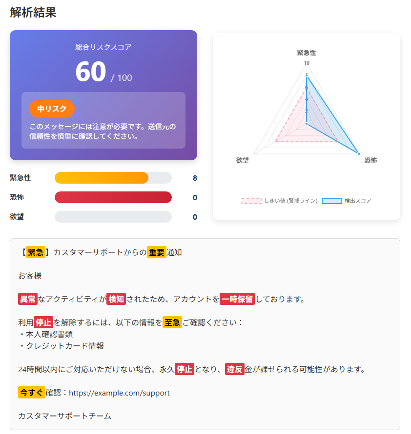

<!--
---
title: Emotion‑Based Scam Detector
category: scam-detection
difficulty: 1
description: Browser-based tool that detects emotion-driven triggers in messages to help users identify potential phishing or scam attempts.
tags: [scam, phishing, social engineering, education, javascript]
demo: https://ipusiron.github.io/emotion-based-scam-detector/
---
-->

# Emotion‑Based Scam Detector - メッセージの感情トリガー検出ツール


[](https://ipusiron.github.io/emotion-based-scam-detector/)

**Day079 - 生成AIで作るセキュリティツール100**

**Emotion‑Based Scam Detector** は、メールやチャットなどの文章に潜む「緊急性」「恐怖」「誘惑」といった感情を刺激するキーワードを検出するツールです。

とくにフィッシングメールや詐欺メッセージでは感情を揺さぶるようなキーワードがよく使われていますが、この事実を逆手に取ることで注意すべきメッセージかどうかを判定できます。

本ツールでは怪しいフレーズをハイライト表示し、リスクの度合いをシンプルな指標で示します。
教育用にも日常のチェックにも活用できます。

---

## 🌐 デモページ

👉 **[https://ipusiron.github.io/leetforge/](https://ipusiron.github.io/leetforge/)**

ブラウザーで直接お試しいただけます。

---

## 📸 スクリーンショット

>
>*フィッシングメールの判定*

---

## ✨ 本ツールの特徴

- **クライアントサイド処理** – 入力データはブラウザー内で解析され、外部に送信されません。プライバシーとセキュリティを重視した設計です。
- **感情トリガーの検出** – **緊急性 (emergency)**、**恐怖 (fear)**、**欲望 (greed)** に関連する単語やフレーズを辞書から照合します。169個のトリガーワードを搭載（日本語・英語対応）。
- **詳細なハイライト表示** – 検出した語句をカテゴリーごとに色分けして表示（緊急性=黄色、恐怖=赤、欲望=緑）。
- **総合リスクスコア** – 0-100点のスコアで詐欺の可能性を数値化。極小リスク/低リスク/中リスク/高リスクの4段階で判定します。
- **視覚的なレーダーチャート** – Chart.jsを使用した3軸レーダーチャートで、各カテゴリーのスコアとしきい値を可視化。
- **カテゴリー別スコア表示** – 各カテゴリー（緊急性・恐怖・欲望）を0-10点で評価し、プログレスバーで表示。
- **豊富なサンプルメッセージ** – 9種類のプリセット（フィッシング詐欺、配送通知詐欺、税務署詐欺、投資詐欺、ロマンス詐欺など）。
- **実践的な対処法ガイド** – 詐欺メッセージへの8つの対処法をアコーディオン形式で表示。
- **辞書のカスタマイズ性** – キーワードを `data/dictionary.json` で管理。日本語・英語の両方に対応し、独自キーワードの追加が簡単です。
- **セキュリティ対策** – XSS対策、CSP、SRI、セキュリティヘッダーを実装し、安全に公開できます。

---

## 💡 活用シナリオ

本ツールは以下のような場面で活用できます。

### シナリオ1: 企業の情報セキュリティ教育

**状況**: 社内でフィッシングメール対策の研修を実施したい企業の担当者

**活用方法**:
1. 研修の冒頭で、受講者に実際のフィッシングメールの例（または本ツールのサンプル）を提示
2. 各自に本ツールで解析してもらい、リスクスコアとトリガーワードを確認
3. レーダーチャートを見ながら「この詐欺メールはどのような感情を狙っているか」をディスカッション
4. 「詐欺メッセージへの対処法」セクションを参照しながら、実際の対応手順を学習
5. 受講者が実際に受信した怪しいメールを持ち寄り、グループで解析・議論

**効果**: 感情的なトリガーを客観的に可視化することで、フィッシング詐欺の手口を理論的に理解でき、警戒心が高まります。

### シナリオ2: 高齢者向けの詐欺被害防止講座

**状況**: 地域の公民館や自治体が開催する、シニア世代向けの詐欺防止セミナー

**活用方法**:
1. スマートフォンやタブレットでツールにアクセス（オフライン対応なので通信環境が悪くても利用可）
2. プリセットから「偽配送通知」「偽税務署」「偽当選通知」などを選択して解析
3. ハイライト表示された「至急」「本日中」「罰金」などの言葉を視覚的に確認
4. 「こういう言葉が入っているメールは危ない」という具体的な判断基準を習得
5. 講師が「実際に怪しいメールが届いたら、まず家族に相談してからこのツールで確認しましょう」と指導

**効果**: ITに不慣れな方でも、シンプルなUIで簡単に詐欺の特徴を学べます。色分けされたハイライトは視覚的に分かりやすく、記憶に残りやすいです。

### シナリオ3: 個人のメールチェック習慣化

**状況**: 日常的に多くのメールを受信するビジネスパーソンや学生

**活用方法**:
1. 送信元が不明な、または少しでも怪しいと感じたメールを受信したとき、すぐにツールを開く
2. メール本文をコピー＆ペーストして解析ボタンをクリック（所要時間10秒）
3. リスクスコアが40点以上（中リスク以上）の場合は、リンクをクリックせず慎重に対応
4. 「SNSで検索」の対処法に従い、Xなどで同様の詐欺報告がないか確認
5. 問題なければ公式サイトに直接ログインして確認、怪しければ削除

**効果**: 日常的にチェックする習慣をつけることで、詐欺被害を未然に防げます。スコアという客観的指標があることで「念のため確認」の判断がしやすくなります。

---

## 📛 名前の由来

プロジェクト名 **「Emotion‑Based Scam Detector」** は以下の要素から成り立っています。

- **Emotion‑Based**: 詐欺メッセージがしばしば利用する「緊急」「恐怖」「誘惑」といった**感情的なトリガー**に着目したツールであることを示します。  
- **Scam**: フィッシングや詐欺など、**悪意あるコミュニケーション**を対象としていることを明示します。  
- **Detector**: 単なる可視化ではなく、怪しい表現を**検出する機能**を持つツールであることを示します。  

わかりやすい名称にすることで、利用者が説明を読まなくてもツールの目的を把握できるよう意識しています。

---

## 🌍 本ツールの生まれた背景

近年、フィッシングメールやオンライン詐欺では、**技術的な脆弱性よりも人間の感情を操る** 手口が多く使われています。攻撃者は受信者の心理を揺さぶるために、**緊急性・恐怖・誘惑** を感じさせる言葉を散りばめ、リンクのクリックや個人情報の入力を促します。

最新のレポートによると、ディープフェイクを悪用したフィッシングや他のソーシャルエンジニアリング攻撃がここ数年で急増し、2022年から2023年にかけてディープフェイク関連のインシデントが **257％** 増加したと報告されています。

また、物理とデジタルが融合する現代のセキュリティ環境では、AI導入が進んでいる一方で適切なツール選定が難しいという声もあります。

---

## 📖 使い方

1. **サンプルを選択（任意）**: ドロップダウンメニューから9種類の詐欺メッセージサンプルを選択できます。または、自分でメールやチャット本文をテキストエリアに貼り付けます。
2. **解析ボタンをクリック**: 「解析」ボタンを押すと解析を開始します。
3. **結果を確認**:
   - **総合リスクスコア**: 0-100点で詐欺の可能性を表示
   - **レーダーチャート**: 3つのカテゴリー（緊急性・恐怖・欲望）のスコアを視覚化
   - **カテゴリー別スコア**: 各カテゴリーの詳細スコア（0-10点）をプログレスバーで表示
   - **ハイライト表示**: 検出されたトリガーワードを色分けして表示
4. **リスク判定を確認**: 極小リスク/低リスク/中リスク/高リスクの判定と、具体的なアドバイスが表示されます。
5. **対処法を確認**: 「🛡️ 詐欺メッセージへの対処法」をクリックすると、8つの実践的な対策が表示されます。
6. **判断の指針とする**: リスクスコアが高いほど感情操作の可能性が高いことを示しています。慎重な対応を検討してください。

---

## 📚 辞書のカスタマイズ

キーワードやフレーズは [`data/dictionary.json`](./data/dictionary.json) に以下のような形式で保存されています。カテゴリーを追加したり単語を編集することで検出ルールを変更できます。

```json
{
  "emergency": [
    "urgent", "immediately", "now", "asap", "至急", "緊急", "今すぐ", ...
  ],
  "fear": [
    "penalty", "fine", "police", "lawsuit", "罰金", "警察", "差し押さえ", ...
  ],
  "greed": [
    "reward", "free", "gift", "prize", "報酬", "無料", "当選", "bonus", ...
  ]
}
```

現在、169個のトリガーワード（緊急性40語、恐怖56語、欲望73語）が登録されています。編集後はページを再読み込みするだけで反映されます。

**注意**: カテゴリー名を増やす場合は `script.js` と `index.html` のレーダーチャート部分にも変更を加える必要があります。

---

## 🔧 技術

このプロジェクトは以下の技術で構成されています。

- **HTML5** – セマンティックなページ構造とセキュリティヘッダー（CSP、X-Frame-Options、X-Content-Type-Options）を実装。
- **CSS3** – グラデーション、アニメーション、レスポンシブデザイン（Grid/Flexbox）を使用したモダンなUI。
- **JavaScript (ES6+)** – 入力処理、`data/dictionary.json` の読み込み、テキスト解析、DOM更新、XSS対策を実装。
- **Chart.js 4.4.0** – レーダーチャートによる視覚的なスコア表示（CDN経由、SRI対応）。
- **JSON** – キーワード辞書とサンプルメッセージの保存に使用。

### セキュリティ対策

- **XSS対策**: ユーザー入力のHTMLエスケープ処理
- **CSP**: 厳格なContent Security Policyを設定
- **SRI**: Subresource Integrityによる外部スクリプトの整合性検証
- **セキュリティヘッダー**: X-Frame-Options、X-Content-Type-Options、Referrer-Policy

サーバー処理がないため、サイトを一度読み込めばオフラインでも利用できます。GitHub Pages、Netlify などの静的ホスティングと相性が良い作りになっています。

---

## 📁 ディレクトリー構成

```
emotion-based-scam-detector/
├── index.html          # メインHTMLファイル（UI、セキュリティヘッダー）
├── style.css           # スタイルシート（グラデーション、アニメーション、レスポンシブ）
├── script.js           # メインロジック（解析、チャート生成、UI制御、XSS対策）
├── data/
│   └── dictionary.json # トリガーワード辞書（169語: 緊急性40、恐怖56、欲望73）
├── assets/
│   └── screenshot.png  # スクリーンショット画像
├── .gitignore          # Git除外設定
├── .nojekyll           # GitHub Pages設定ファイル
├── CLAUDE.md           # Claude Code向けドキュメント
├── README.md           # プロジェクト説明（本ファイル）
└── LICENSE             # MITライセンス
```

---

## 📄 ライセンス

MIT License – 詳細は [LICENSE](LICENSE) を参照してください。

---

## 🛠 このツールについて

本ツールは、「生成AIで作るセキュリティツール100」プロジェクトの一環として開発されました。
このプロジェクトでは、AIの支援を活用しながら、セキュリティに関連するさまざまなツールを100日間にわたり制作・公開していく取り組みを行っています。

プロジェクトの詳細や他のツールについては、以下のページをご覧ください。

🔗 [https://akademeia.info/?page_id=42163](https://akademeia.info/?page_id=42163)
