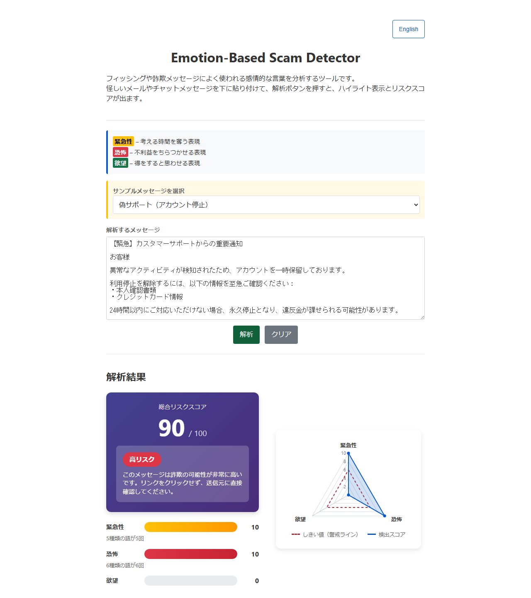
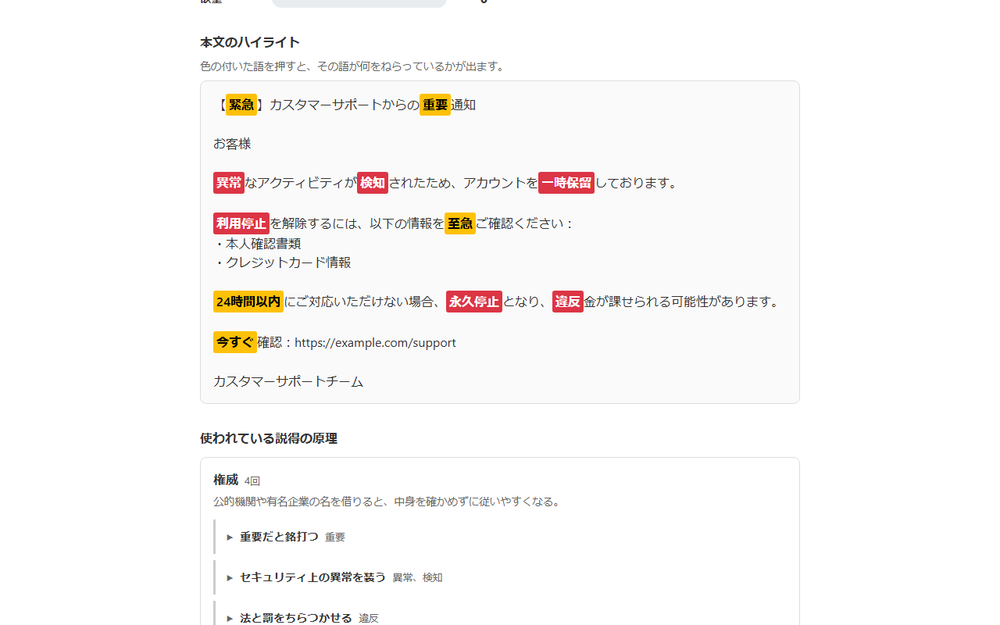
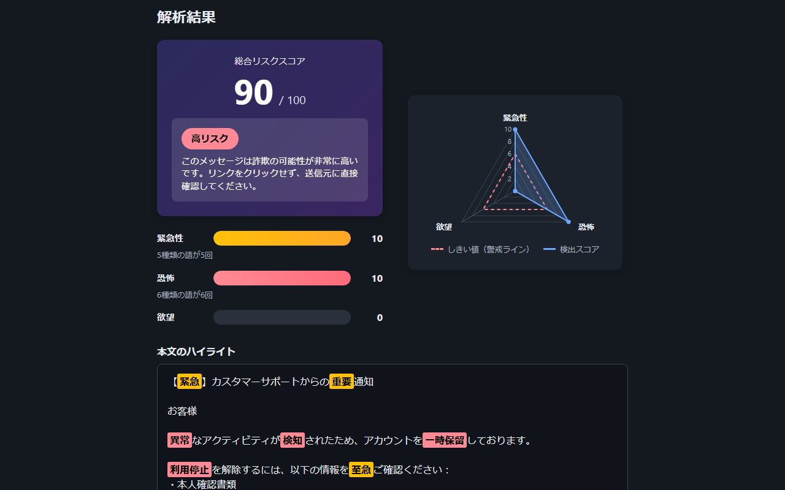

<!--
---
id: day081
slug: emotion-based-scam-detector

title: "Emotion-Based Scam Detector"

subtitle_ja: "メッセージの感情トリガー検出ツール"
subtitle_en: "Emotional trigger detector for phishing and scam messages"

description_ja: "メールやチャットに含まれる「緊急性」「恐怖」「欲望」の感情を刺激するキーワードを検出し、フィッシングや詐欺メッセージを識別するツール。外部に送信せず、ブラウザーの中だけで解析する"
description_en: "Browser-based tool that detects emotion-driven triggers (urgency, fear, greed) in messages to help users identify potential phishing or scam attempts"

category_ja:
  - 詐欺検出
  - ソーシャルエンジニアリング
  - フィッシング詐欺
category_en:
  - Scam Detection
  - Social Engineering
  - phishing

difficulty: 2

tags:
  - scam
  - phishing
  - social-engineering
  - education
  - javascript
  - client-side

repo_url: "https://github.com/ipusiron/emotion-based-scam-detector"
demo_url: "https://ipusiron.github.io/emotion-based-scam-detector/"

hub: true
---
-->

[English](README.en.md) · 日本語

# Emotion-Based Scam Detector - メッセージの感情トリガー検出ツール


[](https://ipusiron.github.io/emotion-based-scam-detector/)

**Day081 - 生成AIで作るセキュリティツール100**

Emotion-Based Scam Detectorは、メールやチャットの文章に潜む「緊急性」「恐怖」「欲望」の3つの感情を刺激する言葉を検出するツールです。

フィッシングメールや詐欺メッセージは、受け取った人の判断を急がせるために感情を揺さぶる言葉を散りばめます。本ツールはその言葉を色分けして示し、どの感情がどれだけ狙われているかをスコアとレーダーチャートで表します。

入力した文章はブラウザーの中だけで処理され、どこにも送信されません。

---

## 🌐 デモページ

👉 **[https://ipusiron.github.io/emotion-based-scam-detector/](https://ipusiron.github.io/emotion-based-scam-detector/)**

ブラウザーで直接お試しいただけます。

---

## 📸 スクリーンショット

>
>*偽サポートを装ったメッセージを解析したところ。総合90点で高リスクと判定している*

>
>*検出した語を感情ごとに色分けして示す。「利用停止」「24時間以内」のような複数文字の語もひとまとまりで示す*

>
>*ダークモードでは配色が切り替わる。レーダーチャートも同じ配色に追従する*

---

## ✨ 機能

- 感情トリガーの検出：緊急性（emergency）・恐怖（fear）・欲望（greed）の3カテゴリー、計167語の辞書と照合する
- ハイライト表示：検出した語をカテゴリーごとに色分けして示す。長い語を優先して照合するので、「利用停止」が「停止」に割れることはない
- 総合リスクスコア：0〜100点で示し、極小リスク・低リスク・中リスク・高リスクの4段階で判定する
- カテゴリー別スコア：各カテゴリーを0〜10点で示し、「何種類の語が何回出たか」を添える
- レーダーチャート：3つの軸でスコアとしきい値を見比べる。SVGで描いているので外部ライブラリーを使わない
- サンプルメッセージ：14種類のプリセット。詐欺メッセージ9種（フィッシング・偽配送通知・偽税務署・投資詐欺・ロマンス詐欺など）と、正規の通知5種（配送通知・銀行のお知らせ・社内リマインド・キャンペーン案内・sign-in alert）
- 偽陽性の体験：正規のサンプルを解析すると、正規の通知にも同じ語が使われることを示す説明が出る
- 対処法ガイド：詐欺メッセージへの8つの対処法をアコーディオンで示す
- 辞書のカスタマイズ：`data/dictionary.json`を編集して語を足せる
- 日英対応：画面の文言を日本語と英語で切り替える。選んだ言語は次に開いたときも保たれる
- ダークモード：OSの設定に合わせて配色が切り替わる
- オフライン動作：外部への通信をいっさい行わない。一度読み込めばネットワークがなくても使える

---

## 📖 使い方

1. サンプルを選ぶか、調べたいメールやメッセージの本文をテキストエリアに貼り付けます。
2. 「解析」ボタンを押します。
3. 結果を読みます。
   - 総合リスクスコア：0〜100点
   - カテゴリー別スコア：緊急性・恐怖・欲望それぞれ0〜10点と、検出した語の種類と回数
   - レーダーチャート：3つの感情の偏りを形で見る
   - 本文のハイライト：どの語が検出されたかを色で見る
4. スコアが高いほど、感情に働きかける言葉が濃く使われていることを示します。送信元やリンク先を確かめる判断材料にしてください。

### ローカルで動かす

```bash
git clone https://github.com/ipusiron/emotion-based-scam-detector.git
cd emotion-based-scam-detector
python -m http.server 8000
# ブラウザーで http://localhost:8000 を開く
```

`index.html`をダブルクリックして開くこともできます。その場合は`fetch`が使えないため、`js/dictionary.js`に収めた内蔵の辞書に切り替わり、画面にその旨が出ます。`data/dictionary.json`の編集を反映させたいときは、上のようにローカルサーバー経由で開いてください。

---

## 📐 画面構成

| 位置 | 要素 | 役割 |
|---|---|---|
| 上部 | 凡例 | 3つのカテゴリーの色と、それぞれが狙う心理 |
| 上部 | サンプル選択 | 9種類のプリセットを読み込む |
| 中央 | 入力欄 | 解析したい本文を貼り付ける |
| 結果左 | 総合スコアと判定 | 0〜100点と4段階の判定、対応の指針 |
| 結果左 | カテゴリー別スコア | 0〜10点の棒グラフと、検出した語の種類・回数 |
| 結果右 | レーダーチャート | 3つの軸のスコアと、しきい値（6点）の警戒ライン |
| 結果下 | 本文のハイライト | 検出した語を色分けした本文 |
| 結果下 | 対処法 | 8つの実践的な対策（折りたたみ） |

---

## 🎯 ユースケース

本ツールは「文章の中の感情に働きかける言葉」を数えて見せるだけの単純な道具です。そのぶん、用途はセキュリティに限りません。

### セキュリティの学習・実務

- 情報セキュリティ研修：受講者に実際の詐欺メールを貼り付けてもらい、どの感情が狙われたかをレーダーチャートの形で見比べて議論する。言葉のどこに圧力があるかを、感想ではなく位置と色で指し示せる。
- 届いたメッセージの一次判断：怪しいと感じたメールの本文を貼り、スコアと検出語を見てから送信元を確かめる。スコアが低くても安全とは限らないので、判断の入口として使う。
- 迷惑メール対策の下調べ：手元に集めた詐欺メッセージを順に流し、どの語が多く出るかを数える。フィルタールールを作るときの当たりをつけられる。
- 辞書を差し替えた分析：`data/dictionary.json`を自分で集めた語彙に入れ替えれば、特定の業種や地域を狙う文面の傾向を調べる道具になる。

### 教育

- 国語・情報の授業：「書き手が読み手を急がせるとき、どんな言葉を選ぶか」を可視化する教材として使う。詐欺に限らず、説得の技術としての言葉づかいを扱える。
- 高齢者向けの詐欺防止講座：プリセットを順に解析し、「至急」「本日中」「罰金」といった言葉が色で浮かび上がる様子を見てもらう。文字を読むのが大変な方にも、色の多さで伝わる。
- 日本語学習：ビジネス日本語で「圧をかける表現」と「ていねいに頼む表現」の違いを、語の単位で確かめる。

### 仕事（セキュリティ以外）

- 自社のお知らせメールの自己点検：カスタマーサポートや広報が送る通知が、詐欺メールと同じ言葉づかいになっていないか確かめる。「至急」「アカウント停止」「本日中」が並ぶ案内は、正当な内容でも受け手に詐欺と疑われる。
- マーケティングのコピーの点検：「今だけ」「限定」「必ず」「確実」の密度を数え、煽りすぎていないかを自分で測る。欲望のスコアが10点に張り付くコピーは、読み手の警戒心も引き上げている。
- 社内規程や通知文の見直し：恐怖のスコアが高い文面は、読み手を萎縮させている可能性がある。書き直しの検討材料にする。

### 暮らし・家庭

- 家族と一緒に確かめる：届いたSMSやメールを家族の端末で一緒に貼り付け、色のついた語を声に出して読む。「この言葉が出たら一度止まる」という共通の合図を家の中に作れる。
- フリマアプリやSNSのやり取りの見直し：取引相手のメッセージに、急がせる言葉や得を強調する言葉がどれだけ入っているかを確かめる。

### 趣味・創作

- 小説・シナリオの執筆：作中の詐欺師や交渉役のセリフに、どの感情の語をどれだけ入れたかを数える。狙った感情に偏っているかを確かめられる。
- 謎解き・TRPG・脱出ゲームの制作：参加者に見破らせるための偽の通知文を作り、感情語の配分を調整する。
- 広告・迷惑メールの収集と観察：集めたものを並べて解析し、手口の流行を自分なりに記録する。

### 研究・調べもの

- 説得の原理の学習：フィッシングの研究では、Cialdiniの6原理（権威・社会的証明・好意・返報性・一貫性・希少性）との対応が調べられています。本ツールの3カテゴリーはその一部を切り出したものなので、原典と見比べながら「この辞書に足りない軸は何か」を考える出発点になる。
- 日本語と英語の比較：同じ趣旨の詐欺文面を日本語版と英語版で解析し、言葉の選び方の違いを見る。辞書は両方の言語を収めている。

### ほかのツールとの組み合わせ

- 本文の感情語は本ツールで、本文に含まれるURLの安全性は別のツールで、というように役割を分けて使う。本ツールは送信元もリンク先も見ない。
- 「生成AIで作るセキュリティツール100」の他のツールと並べて、ソーシャルエンジニアリングの各段階を順に扱う教材にする。

---

## 🔬 技術的な説明

### 照合のしかた

辞書の語を長い順に並べ、本文を先頭から1回だけ走査します。一致した範囲は読み飛ばすので、同じ場所が二度数えられることはありません。

語の境界は、語の端がASCIIの英数字のときだけ、その側に要求します。

| 語 | 本文 | 検出 | 理由 |
|---|---|---|---|
| `now` | `he is known now` | 末尾の`now`だけ | 両端がASCIIなので、英単語の途中では一致しない |
| `24時間以内` | `期限は24時間以内です` | 一致する | 末尾が日本語なので、後ろに何が続いてもよい |
| `利用停止` | `利用停止を解除` | `利用停止` | 長い語を先に試すので`停止`に割れない |

### スコアの出しかた

カテゴリーごとに、検出した語の種類の数と、出現した回数から点を出します。

```
raw          = 異なり語数 + 0.5 × (出現回数 − 異なり語数)
カテゴリー点 = min(10, round(raw × 2))
```

2回目以降の出現は半分の重みで数えます。5種類の語がそろうと上限の10点に達します。

総合点は、カテゴリー点を高い順に並べ、上位ほど重い重みを掛けて出します。

```
s1 ≥ s2 ≥ s3 = カテゴリー点を降順に並べたもの
総合点       = round(10 × (0.6×s1 + 0.3×s2 + 0.1×s3))
```

平均ではなく上位を重く見るのは、現実の詐欺が3つの感情を均等に使わないためです。フィッシングは「緊急性と恐怖」、当選通知は「緊急性と欲望」のように2つに寄ります。

判定は総合点のしきい値で決まります。

| 総合点 | 判定 |
|---|---|
| 70以上 | 高リスク |
| 40〜69 | 中リスク |
| 15〜39 | 低リスク |
| 14以下 | 極小リスク |

### サンプルメッセージのスコア

同梱の詐欺メッセージ9種類を解析すると、次の値になります。

| サンプル | 緊急性 | 恐怖 | 欲望 | 総合 | 判定 |
|---|---|---|---|---|---|
| フィッシング詐欺（アカウント確認） | 10 | 8 | 0 | 84 | 高リスク |
| 偽配送通知（不在通知） | 10 | 0 | 0 | 60 | 中リスク |
| 偽サポート（アカウント停止） | 10 | 10 | 0 | 90 | 高リスク |
| 偽税務署（未納税金） | 7 | 6 | 0 | 60 | 中リスク |
| 投資詐欺（高額収益） | 6 | 0 | 10 | 78 | 高リスク |
| 偽当選通知（高額賞金） | 8 | 2 | 10 | 86 | 高リスク |
| 偽副業案内（高収入） | 2 | 0 | 10 | 66 | 中リスク |
| ロマンス詐欺（投資勧誘） | 2 | 0 | 10 | 66 | 中リスク |
| Phishing (Account Security) | 10 | 8 | 2 | 86 | 高リスク |

ロマンス詐欺が中リスクに留まるのは、この手口が感情語を散らさず、時間をかけて信頼を作るためです。本文1通では辞書照合で捕まえにくいことを、スコアがそのまま示しています。

正規のメッセージ5種類も同梱しています。

| サンプル | 緊急性 | 恐怖 | 欲望 | 総合 | 判定 |
|---|---|---|---|---|---|
| 正規の配送通知 | 0 | 0 | 0 | 0 | 極小リスク |
| 正規の銀行からのお知らせ | 0 | 2 | 0 | 12 | 極小リスク |
| 正規の社内リマインド | 7 | 0 | 0 | 42 | 中リスク |
| 正規のキャンペーン案内 | 0 | 2 | 8 | 54 | 中リスク |
| Legitimate sign-in alert | 0 | 6 | 0 | 36 | 低リスク |

経費精算の締切を知らせる社内のリマインドが中リスクになるのは、「本日中」「期限」「至急」が正規の連絡でもふつうに使われるためです。正規のキャンペーン案内も「限定」「無料」「特典」で中リスクに届きます。逆に、正規の配送通知は0点です。

これらを解析すると、画面に偽陽性についての説明が出ます。スコアの高さが詐欺の証拠ではないこと、スコアの低さが安全の証明ではないことを、数字の上で確かめられます。

### レーダーチャート

外部ライブラリーを使わず、SVGで描いています。軸の角度は`-90° + i × 360 / 軸数`で、最初の軸が真上を向きます。頂点を出す関数は描画と切り離してあるので、座標そのものをテストで検証しています。軸の数は値の数で決まるため、カテゴリーを増やしても描き分けは変わりません。

### 辞書のカスタマイズ

語は[`data/dictionary.json`](./data/dictionary.json)に収めています。

```json
{
  "emergency": ["urgent", "immediately", "至急", "緊急", "今すぐ"],
  "fear": ["penalty", "police", "罰金", "警察", "利用停止"],
  "greed": ["reward", "free", "報酬", "無料", "当選"]
}
```

現在167語（緊急性38語、恐怖56語、欲望73語）を収めています。編集後はページを再読み込みすれば反映されます。

同じ内容を[`js/dictionary.js`](./js/dictionary.js)にも持たせています。これは`file://`で開いたときに使う控えで、2つの内容が一致することをテストが検証します。語を足すときは両方を直してください。

カテゴリー名を増やす場合は、`js/scam-core.js`の重みの表と`script.js`の表示するカテゴリーの一覧、`index.html`の凡例と棒グラフにも手を入れる必要があります。

---

## 🔒 セキュリティ

- クライアントサイド処理：入力した文章はブラウザーの中だけで処理され、外部に送信されません。
- Content Security Policy：`default-src 'self'`を基本とし、外部の取得元をいっさい許していません。インラインのスクリプトとスタイルも使っていません。
- XSS対策：本文はすべてエスケープしてから、一致した範囲だけを`span`で包みます。入力に含まれるタグが画面の組み立てに混ざることはありません。
- 外部依存なし：CDNもnpmパッケージも使いません。読み込むのはリポジトリー内のファイルだけです。
- Referrer-Policy：`no-referrer`を指定しています。

`X-Frame-Options`や`X-Content-Type-Options`、CSPの`frame-ancestors`は`meta`タグでは効きません。本ツールはそれらを書かず、HTTPヘッダーで設定すべきものとして扱っています。GitHub Pagesで配信する場合、これらのヘッダーは設定できません。

---

## ⚠️ 注意

本ツールのスコアは、本文に出てくる語を辞書と照合しただけの目安です。次のことは判定していません。

- 送信元のアドレスやメールヘッダーの詐称
- リンク先のURLや、表示されている文字列との食い違い
- 添付ファイル
- 文脈や、やり取りの経緯

辞書にない言い回しは拾えません。逆に、正規の企業からの通知にも「重要」「確認」「期限」といった語は使われるため、本物を高く判定すること（偽陽性）もあります。スコアが低いことは安全の証明にはなりません。

最終的な判断は、公式サイトや窓口に自分から連絡して確かめてください。

---

## ❓ FAQ

**Q. 入力した内容はどこかに送られますか。**

A. 送られません。解析はすべてブラウザーの中で完結します。通信するのは、ページと辞書ファイルを読み込むときだけです。

**Q. なぜ`file://`で開くと「内蔵の辞書を使っています」と出るのですか。**

A. ブラウザーの制限で、`file://`では`fetch`が使えず`data/dictionary.json`を読めないためです。内容は同じなので解析の結果は変わりません。`data/dictionary.json`を編集して試したいときだけ、ローカルサーバー経由で開いてください。

**Q. 日本語以外にも使えますか。**

A. 辞書に英語の語も収めているので、英文にも使えます。他の言語を使うときは、`data/dictionary.json`と`js/dictionary.js`に語を足してください。

**Q. カテゴリーを増やせますか。**

A. 増やせます。辞書にキーを足し、`js/scam-core.js`の重みの表に同じ長さの重みを足してください。レーダーチャートは軸の数を自動で合わせます。

**Q. スコアが70点に届かないメッセージは安全ですか。**

A. 安全とは限りません。感情語の少ない詐欺もあります。同梱のロマンス詐欺のサンプルが66点に留まるのが、その例です。

---

## 🧪 テスト

```bash
npm test
```

Node.js 22以上で動きます。依存パッケージはありません（`node --test`だけを使います）。

検証している内容は次のとおりです。

- 照合と採点：最長一致、語境界、二重計上が起きないこと、辞書の167語すべてが単独でも文中でも検出できること
- レーダーチャート：頂点の座標とviewBox、軸の数が変わっても描き分けられること
- 辞書：`data/dictionary.json`と`js/dictionary.js`の一致、語数、カテゴリーをまたぐ重複がないこと
- サンプル：9種類のプリセットのスコアと判定（本READMEの表と同じ値）
- HTML：CSPの内容、外部の読み込みがないこと、インラインのハンドラーとstyle属性がないこと、要素のid
- 配色：ライトとダークの両方で、文字と背景のコントラスト比が4.5:1以上であること
- 画面の文言：日本語と英語のキーが一致すること、英語の辞書に日本語が残っていないこと、
  2つのREADMEの見出しが対応していること
- 書式：行の長さ、表記のゆれ、日本語と英数字の間の空白

GitHub Actionsで、pushとpull requestのたびに自動で実行されます。

---

## 📁 ディレクトリー構造

```
emotion-based-scam-detector/
├── index.html              # 画面の構造（凡例・入力欄・結果・対処法）
├── style.css               # 配色（CSS変数）・レイアウト・ダークモード
├── script.js               # 画面の処理（入力の受け取りと表示の更新）
├── js/                     # 画面から読み込むスクリプト
│   ├── scam-core.js        # 照合と採点（DOMに触れない）
│   ├── radar.js            # レーダーチャートのSVG描画
│   ├── messages.js         # 画面に出す文言の辞書（日本語と英語）
│   ├── dictionary.js       # トリガーワード辞書の内蔵の控え（file://用）
│   └── samples.js          # サンプルメッセージ9種
├── data/                   # 編集して使うデータ
│   └── dictionary.json     # トリガーワード辞書（167語）
├── assets/                 # 画像
│   ├── screenshot.png      # 代表画面（ライト）
│   ├── screenshot2.png     # 本文のハイライト
│   ├── screenshot3.png     # スコアとレーダー（ダーク）
│   └── en/                 # 英語表示の同じ画面
│       ├── screenshot.png  # 代表画面（ライト）
│       ├── screenshot2.png # 本文のハイライト
│       └── screenshot3.png # スコアとレーダー（ダーク）
├── test/                   # 自動テスト（node --test）
│   ├── load.js             # 画面のスクリプトをテストから読み込む補助
│   ├── scam-core.test.js   # 照合と採点の検証
│   ├── radar.test.js       # レーダーの頂点とviewBoxの検証
│   ├── dictionary.test.js  # 辞書の中身と、2つの辞書の一致の検証
│   ├── samples.test.js     # サンプルのスコアの検証
│   ├── messages.test.js    # 文言の辞書の検証
│   ├── i18n.test.js        # 日本語と英語がそろっていることの検証
│   ├── readme.test.js      # READMEの表・語数・構造の検証
│   ├── html.test.js        # index.htmlの静的な検証
│   ├── contrast.test.js    # 配色のコントラスト比の検証
│   └── format.test.js      # 行の長さと表記の検証
├── .github/                # GitHubの設定
│   └── workflows/          # GitHub Actionsのワークフロー
│       └── test.yml        # pushとpull requestでnpm testを走らせる
├── package.json            # テストの実行設定（依存パッケージなし）
├── .gitignore              # Gitの除外設定
├── .nojekyll               # GitHub PagesでJekyllを使わない印
├── CLAUDE.md               # Claude Code向けの案内
├── README.md               # 本ファイル
├── README.en.md            # 英語版のREADME
└── LICENSE                 # MITライセンス
```

---

## 💻 動作環境

- ブラウザー：Chrome、Edge、Firefox、Safariの最新版
- テストの実行：Node.js 22以上（依存パッケージなし）
- サーバー：不要。静的ホスティング（GitHub Pages、Netlifyなど）で動く

---

## 📄 ライセンス

MIT License – 詳細は [LICENSE](LICENSE) を参照してください。

---

## 🔗 参考

- [フィッシング対策協議会 月次報告書](https://www.antiphishing.jp/report/monthly/) – 日本国内のフィッシング報告件数と手口の動向。2026年8月の報告件数は82,338件、悪用されたブランドは96件
- [Persuasion and Phishing: Analysing the Interplay of Persuasion Tactics in Cyber Threats](https://arxiv.org/pdf/2412.18485) – フィッシングで使われる説得の原理を分析した調査
- [The Persuasive Phish: Examining the Social Psychological Principles Hidden in Phishing Emails](https://archive.cps-vo.org/node/26912) – 米国3大学の887通のフィッシングメールをCialdiniの6原理で分類した研究

---

## 🛠 このツールについて

本ツールは、「生成AIで作るセキュリティツール100」プロジェクトの一環として開発されました。
このプロジェクトでは、AIの支援を活用しながら、セキュリティに関連するさまざまなツールを100日間にわたり制作・公開していく取り組みを行っています。

プロジェクトの詳細や他のツールについては、以下のページをご覧ください。

🔗 [https://akademeia.info/?page_id=42163](https://akademeia.info/?page_id=42163)
